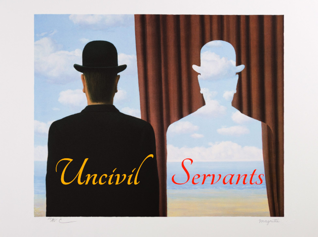

# Uncivil Servants

_A game about teamwork and backstabbing._

The current Deputy Minister is retiring in a year, and you need to show competence and gain the favour of the current government, so you can succeed as the next Deputy Minister. You can collaborate with the other players to make your agency more prestigious, or you can decide to sabotage your fellow Directors to discredit them in the eyes of the goverment. Which way will you play?

## Introduction

_Uncivil Servants_ is a game for 2-4 plyers. As a player, you embody the Director of one or four divisions in a government agency:

- Operations (blue)
- Finance (green)
- Information Technology (yellow)
- Human Resources (red)

## Game turns

The game runs over 4 rounds, representing a quarter of a year. In each quarter, each player has 3 turns. So in a full game, each player has a total of 12 turns, unless a catastrophic game end is triggered.

## Success tracks

Tracks with 11 spaces, from -5 to +5. Game starts at 0. If any of the three tracks ends at -5, the agency is disgraced and the government launches an investigation. All players lose.

- Service Delivery
- Financial Sustainability
- Employee Engagement
- Modernisation

## Targets

## Events

## Special rules

- For 2 players: each players controls 2 Divisions
- For 3 players: each player controls 3 Divisions, the fourth player is controlled by a random bot (see special bot rules below).
  